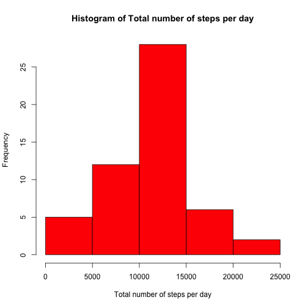
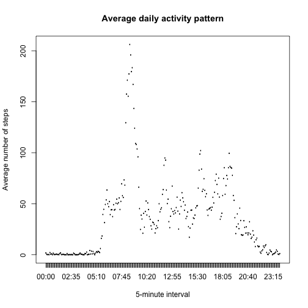
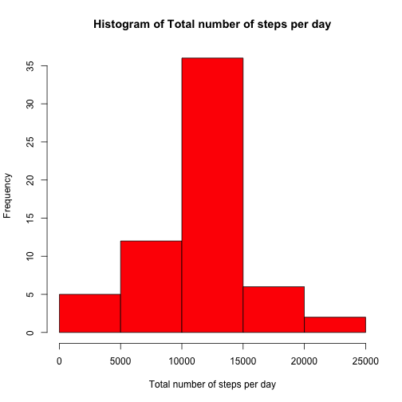
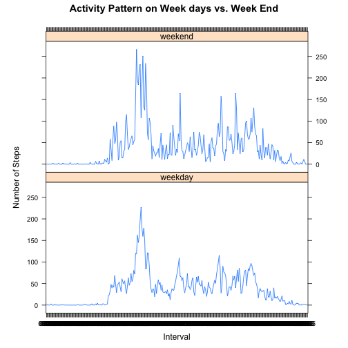

# Reproducible Research: Peer Assessment 1
=======

## Loading and preprocessing the data

The activity data are made available as a zip, which we unzip if needed.

We load the data using CSV format: 17568 observations of 3 variables:
* steps (int)
* date (factor with 61 levels)
* interval (int)


```r
# Check if data file is present, and download and extract if needed
if (!file.exists("activity.csv")) {
    unzip("activity.zip")
}
rawData <- read.csv("activity.csv")
```


We transform the data so that the types of the columns are appropriate for further analysis:


```r
get.interval <- function(interval_integer) {
    nb_of_hours = interval_integer%/%100
    nb_of_minutes = interval_integer%%100
    return(paste(sprintf("%02d", nb_of_hours), sprintf("%02d", nb_of_minutes), 
        sep = ":"))
}
activityDF <- data.frame(rawData$steps, as.Date(rawData$date, "%Y-%m-%d"), get.interval(rawData$interval))
colnames(activityDF) <- c("number_of_steps", "date", "interval")
```


## What is mean total number of steps taken per day?

The mean total number of steps taken per day is calculated as sum of column *number_of_steps* for each day in the interval of observation. Missing values in this column, coded as NA, are just ignored for this calculation.


```r
require(data.table)  # Will load the package if not present
```

```
## Loading required package: data.table
```

```r
# Filter out NA values for steps
activityDTfiltered <- data.table(activityDF[!(is.na(activityDF$number_of_steps)), 
    ])

# Sum steps by date
activityDTsummed <- activityDTfiltered[, list(total_number_of_steps = sum(number_of_steps)), 
    by = date]
# Plots a histogram
hist(activityDTsummed$total_number_of_steps, col = "red", xlab = "Total number of steps per day", 
    main = "Histogram of Total number of steps per day")
```

 


```r
total_steps_mean <- mean(activityDTsummed$total_number_of_steps)
total_steps_median <- median(activityDTsummed$total_number_of_steps)
```


The *mean* total number of steps taken per day is 10766

The *median* total number of steps taken per day is 10765

## What is the average daily activity pattern?

Here is the average number of steps taken, averaged across all days, for each 5-minute interval.


```r
activityDTavgtotstepby5mn <- activityDTfiltered[, list(average_number_of_steps = mean(number_of_steps)), 
    by = interval]
plot(activityDTavgtotstepby5mn$interval, activityDTavgtotstepby5mn$average_number_of_steps, 
    type = "l", ylab = "Average number of steps", xlab = "5-minute interval", 
    main = "Average daily activity pattern")
```

 


```r
max_average_number_of_steps <- max(activityDTavgtotstepby5mn$average_number_of_steps)
max_5mn_interval <- activityDTavgtotstepby5mn[average_number_of_steps == max_average_number_of_steps, 
    ]
```


The maximum number of steps, on average and across all days in the dataset, is 206.2.

This maximum is reached during the 5-minute interval starting at 08:35.

## Imputing missing values

To better understand the influence of missing values, 
it can be noted that the number of rows having NA as 


```r
nas_for_steps <- nrow(activityDF[is.na(activityDF$number_of_steps), ])
nas_for_date <- nrow(activityDF[is.na(activityDF$date), ])
nas_for_interval <- nrow(activityDF[is.na(activityDF$interval), ])
```


* *number_of_steps* is: 2304
* *date* is: 0
* *interval* is: 0

As some days are completely missing data, and our objective is to understand the average daily activity pattern, we will assume that each row missing data on number of steps is equal to 
the mean for the 5-minute interval of that row, based on the analysis above.


```r
# this function returns the average number of steps for a 5-minute interval
get.mean.number.steps <- function(interval.input) {
    activityDTavgtotstepby5mn[activityDTavgtotstepby5mn$interval == interval.input, 
        average_number_of_steps]
}
# copy the original data frame
activityDTfilled <- data.table(activityDF)
activityDTfilled[is.na(number_of_steps), `:=`(number_of_steps, activityDTavgtotstepby5mn[activityDTavgtotstepby5mn$interval == 
    interval, average_number_of_steps])]
```

```
## Warning: Coerced 'double' RHS to 'integer' to match the column's type; may
## have truncated precision. Either change the target column to 'double'
## first (by creating a new 'double' vector length 17568 (nrows of entire
## table) and assign that; i.e. 'replace' column), or coerce RHS to 'integer'
## (e.g. 1L, NA_[real|integer]_, as.*, etc) to make your intent clear and for
## speed. Or, set the column type correctly up front when you create the
## table and stick to it, please.
```

```
##        number_of_steps       date interval
##     1:               1 2012-10-01    00:00
##     2:               0 2012-10-01    00:05
##     3:               0 2012-10-01    00:10
##     4:               0 2012-10-01    00:15
##     5:               0 2012-10-01    00:20
##    ---                                    
## 17564:               4 2012-11-30    23:35
## 17565:               3 2012-11-30    23:40
## 17566:               0 2012-11-30    23:45
## 17567:               0 2012-11-30    23:50
## 17568:               1 2012-11-30    23:55
```


Using the updated dataset, the histogram is the following:


```r
# Sum steps by date
activityDTsummed <- activityDTfilled[, list(total_number_of_steps = sum(number_of_steps)), 
    by = date]
# Plots a histogram
hist(activityDTsummed$total_number_of_steps, col = "red", xlab = "Total number of steps per day", 
    main = "Histogram of Total number of steps per day")
```

 

```r
# .data$Global_active_power, col = 'red', xlab = 'Global Active Power
# (kilowatts)', main='Global Active Power')
```


```r
total_steps_mean2 <- mean(activityDTsummed$total_number_of_steps)
total_steps_median2 <- median(activityDTsummed$total_number_of_steps)
```


The *mean* total number of steps taken per day is now 10749

The *median* total number of steps taken per day is now 10641

The evolution of the *mean* is -0.1579 %.

The evolution of the *median* is -1.1519 %.

## Are there differences in activity patterns between weekdays and weekends?

After adding a column (factor variable) to our data set to differentiate week days from week end,

```r
# Add factor column for 'weekday' and 'weekend'
activityDTweekdays <- activityDTfilled[, `:=`(day, ifelse(as.POSIXlt(as.Date(activityDTsummed$date))$wday%%6 == 
    0, "weekend", "weekday"))]
```


we can now visualize the different activity patterns during the week versus the weekend:
* calculate the mean number of steps, by interval and type of day
* display one chart per type of day


```r
activity_by_type_of_day = aggregate(number_of_steps ~ interval + day, activityDTweekdays, 
    mean)
library(lattice)
xyplot(number_of_steps ~ interval | factor(day), data = activity_by_type_of_day, 
    aspect = 1/2, type = "l", xlab = "Interval", ylab = "Number of Steps", main = "Activity Pattern on Week days vs. Week End", 
    rot = 90)
```

 


The chart above shows difference in activity patterns that woul require further analysis.
